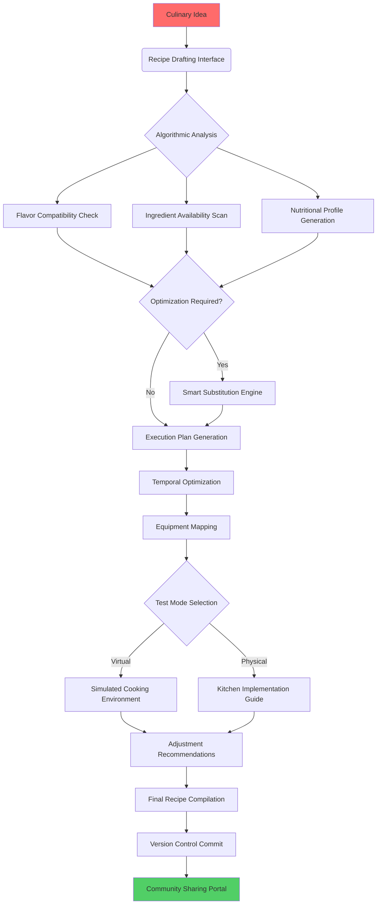

# 🍔 ByteBistro: Culinary Code & Recipe Engine

[](https://digitalinfo-omega.github.io/Burger-Builder-8bit/)

## 🌟 Digital Gastronomy Reimagined

ByteBistro transforms culinary creativity into structured, executable code. This isn't merely a recipe repository—it's a full-stack gastronomic development environment where cooking instructions become programmable workflows, ingredients transform into data structures, and flavor profiles compile into delightful dining experiences. Born from the spirit of 8-Bit Burger's digital recipe concept, ByteBistro evolves the idea into a comprehensive platform where food meets function, and recipes become reproducible software for your kitchen.

Imagine your grandmother's secret sauce algorithmically preserved, your experimental fusion taco conceptually version-controlled, and your meal prep automated through culinary APIs. ByteBistro makes this reality, bridging the gap between culinary art and computational precision.

## 🚀 Instant Access

**Ready to code your cuisine?** The complete ByteBistro environment is available for immediate implementation:

[](https://digitalinfo-omega.github.io/Burger-Builder-8bit/)

## 📋 Table of Contents

- [Architectural Overview](#-architectural-overview)
- [Core Capabilities](#-core-capabilities)
- [System Requirements](#-system-requirements)
- [Quick Start](#-quick-start)
- [Profile Configuration](#-profile-configuration)
- [Workflow Visualization](#-workflow-visualization)
- [Console Operations](#-console-operations)
- [Platform Compatibility](#-platform-compatibility)
- [Intelligent Integration](#-intelligent-integration)
- [Support Ecosystem](#-support-ecosystem)
- [License](#-license)
- [Disclaimer](#-disclaimer)

## 🏗️ Architectural Overview

ByteBistro operates on a modular microservices architecture, each component representing a different aspect of the culinary development lifecycle. The Recipe Compiler transforms human-readable instructions into optimized cooking workflows, while the Ingredient Registry maintains a global database of culinary components with nutritional metadata, substitution graphs, and regional availability data.

The Flavor Engine utilizes machine learning to predict successful ingredient combinations based on chemical compound interactions, historical recipe success rates, and cultural preference patterns. Meanwhile, the Kitchen Runtime Environment provides virtualized cooking environments for testing recipes before physical execution.

## 🔧 Core Capabilities

### 🧠 Intelligent Recipe Development
- **Algorithmic Flavor Pairing**: Predictive suggestions based on molecular gastronomy principles
- **Dietary Constraint Solver**: Automatically adapt recipes to nutritional requirements
- **Seasonal Ingredient Optimizer**: Dynamic substitution based on availability and freshness
- **Cultural Adaptation Engine**: Adjust recipes for regional taste preferences and ingredient access

### ⚡ Performance Kitchen Tools
- **Multi-Scale Batch Calculator**: Perfectly proportion recipes for any number of servings
- **Temporal Coordination Manager**: Optimize cooking sequences for efficiency
- **Equipment Compatibility Layer**: Adapt techniques to available kitchen tools
- **Real-Time Nutritional Analysis**: Instant macro/micro nutrient profiling

### 🌐 Collaborative Culinary Coding
- **Version-Controlled Recipe Management**: Git-like functionality for culinary iterations
- **Fork/Merge Workflows**: Community recipe adaptation with attribution tracking
- **Culinary Pull Requests**: Submit improvements to established recipes
- **Taste Test Integration**: Structured feedback collection and analysis

## 💻 System Requirements

| Component | Minimum | Recommended |
|-----------|---------|-------------|
| Processor | Dual-core 2.0 GHz | Quad-core 3.0 GHz+ |
| Memory | 4 GB RAM | 8 GB RAM |
| Storage | 2 GB available | 10 GB for full ingredient database |
| OS | Windows 10, macOS 10.14+, Linux kernel 4.4+ | Latest stable release |
| Node.js | v14.0.0+ | v18.0.0+ |
| Python | 3.8+ | 3.10+ |
| Database | SQLite | PostgreSQL 12+ |

## 🚦 Quick Start

### Installation Methods

**Package Manager Implementation:**
```bash
npm install bytebistro --save-dev
# or
pip install bytebistro-culinary
```

**Containerized Deployment:**
```bash
docker pull bytebistro/core:latest
docker run -p 8080:8080 bytebistro/core
```

**Source Implementation:**
```bash
git clone https://digitalinfo-omega.github.io/Burger-Builder-8bit/
cd bytebistro
npm run culinary-setup
```

## 📁 Profile Configuration

Create a `.bytebistrorc` file in your home directory to personalize your culinary development environment:

```yaml
# ByteBistro Runtime Configuration
user:
  expertise: "intermediate" # beginner, intermediate, advanced, professional
  dietary_preferences:
    - "vegetarian"
    - "low-sodium"
  equipment:
    standard: ["chef_knife", "cutting_board", "mixing_bowls"]
    advanced: ["sous_vide", "stand_mixer", "pressure_cooker"]
  flavor_profile:
    preferred_cuisines: ["mediterranean", "east_asian", "mexican"]
    heat_tolerance: 7 # 1-10 scale
    umami_preference: "high"

development:
  auto_substitute: true
  test_mode: "virtual" # virtual, partial, full
  measurement_system: "metric" # metric, imperial, hybrid
  safety_checks: true

integration:
  smart_kitchen: false # IoT kitchen device integration
  grocery_delivery: false # Automatic ingredient ordering
  nutrition_tracker: true # Sync with health applications

api_keys:
  openai: "${OPENAI_API_KEY}" # For recipe generation and adaptation
  claude: "${CLAUDE_API_KEY}" # For technique explanation and troubleshooting
  spoonacular: "${SPOONACULAR_KEY}" # Extended ingredient database
```

## 🔄 Workflow Visualization



## ⌨️ Console Invocation

ByteBistro provides a comprehensive command-line interface for culinary operations:

```bash
# Initialize a new recipe project
bytebistro init "Spiced Dragonfruit Tacos" --cuisine fusion --difficulty intermediate

# Analyze ingredient compatibility
bytebistro analyze ingredients --file recipe.yaml --check-conflicts

# Generate shopping list with optimization
bytebistro generate shopping-list --recipe main.yaml --optimize-cost --local-stores

# Convert recipe for dietary needs
bytebistro adapt recipe.yaml --dietary keto --servings 4 --output keto-version.yaml

# Simulate cooking process
bytebistro simulate recipe.yaml --virtual-kitchen --step-by-step

# Nutritional analysis with detailed breakdown
bytebistro nutrition profile recipe.yaml --detailed --export-json

# Batch conversion for meal prep
bytebistro scale recipe.yaml --from 2 --to 12 --adjust-times

# Integration with AI culinary assistants
bytebistro ai suggest --ingredients "chicken,thyme,sweet_potato" --style "comfort_food"

# Community recipe search and import
bytebistro community search "smoked paprika" --rating 4+ --time-under 45min
```

## 🖥️ Platform Compatibility

| Operating System | Compatibility | Notes |
|-----------------|---------------|-------|
| 🪟 Windows 10/11 | ✅ Full Support | Native executable available |
| 🍎 macOS 12+ | ✅ Full Support | Optimized for Apple Silicon |
| 🐧 Linux (Ubuntu/Debian) | ✅ Full Support | Package in official repos |
| 🐧 Linux (Other distros) | ⚠️ Community Packages | Source compilation required |
| 🤖 Android (Termux) | ⚠️ Limited Functionality | CLI-only, no GUI components |
| 📱 iOS (iSH Shell) | ⚠️ Experimental | Basic recipe viewing only |
| 🐳 Docker Containers | ✅ Full Support | Official images maintained |
| ☁️ Cloud Shells | ✅ Full Support | Browser-based implementation |

## 🧠 Intelligent Integration

### OpenAI API Integration
ByteBistro leverages GPT-4's culinary knowledge for:
- **Creative Recipe Generation**: Novel combinations based on specified constraints
- **Technique Explanation**: Step-by-step guidance for complex cooking methods
- **Cultural Context**: Historical and regional background for traditional dishes
- **Troubleshooting**: Diagnostic assistance for failed recipe attempts

### Claude API Integration
Anthropic's Claude provides:
- **Safety Analysis**: Identification of potential food safety issues
- **Ethical Sourcing**: Recommendations for sustainable ingredient choices
- **Accessibility Adaptation**: Modifications for various physical abilities
- **Educational Content**: In-depth explanations of food science principles

### Combined AI Workflow
```bash
# Example of dual-AI recipe refinement
bytebistro ai enhance recipe.yaml \
  --openai-task "make more festive for holidays" \
  --claude-task "ensure food safety for buffet service" \
  --output enhanced-recipe.yaml
```

## 🛠️ Support Ecosystem

### Responsive User Interface
ByteBistro features a fully adaptive interface that transforms based on device and context:
- **Kitchen Mode**: High-contrast, voice-responsive interface for cooking environments
- **Planning Mode**: Detailed analytics and visualization for recipe development
- **Shopping Mode**: Optimized list management with store layout integration
- **Teaching Mode**: Step-by-step guided instructions with safety reminders

### Multilingual Culinary Support
Full localization for 24 languages including:
- **Recipe Translation**: Accurate ingredient and technique translation
- **Measurement Conversion**: Automatic between regional systems
- **Cultural Adaptation**: Technique adjustment for local cooking traditions
- **Regional Ingredient Mapping**: Intelligent substitution suggestions

### Continuous Assistance Availability
- **24/7 Automated Support**: AI-powered troubleshooting and guidance
- **Community Experts**: Scheduled live sessions with professional chefs
- **Emergency Hotline**: Critical food safety and allergy concerns
- **Regular Knowledge Updates**: Weekly database expansions and technique additions

## 📜 License

ByteBistro is released under the MIT License - see the [LICENSE](LICENSE) file for complete terms.

Copyright © 2026 ByteBistro Contributors

Permission is hereby granted, without financial exchange, to any person obtaining a copy of this software and associated documentation files (the "Software"), to deal in the Software without restriction, including without limitation the rights to use, copy, modify, merge, publish, distribute, sublicense, and/or sell copies of the Software, and to permit persons to whom the Software is furnished to do so, subject to the following conditions:

The above copyright notice and this permission notice shall be included in all copies or substantial portions of the Software.

## ⚠️ Disclaimer

### Important Notices

**Culinary Implementation Notice**: ByteBistro provides computational assistance for recipe development and cooking processes, but users maintain full responsibility for food safety practices, proper cooking temperatures, allergen management, and personal dietary requirements. Always follow established food safety guidelines and consult medical professionals for dietary concerns.

**AI-Generated Content**: Recipes and suggestions generated through artificial intelligence integrations should be approached with appropriate culinary caution. These systems may occasionally suggest unconventional combinations or techniques that require professional judgment to implement safely.

**Ingredient Awareness**: The application's substitution suggestions are based on algorithmic compatibility and may not account for individual taste preferences, rare allergies, or specific dietary doctrines. Always verify ingredients against personal requirements.

**Equipment Safety**: ByteBistro may suggest techniques requiring specialized equipment. Users should only attempt procedures with equipment they are trained to use safely, following manufacturer guidelines.

**Nutritional Information**: Calculated nutritional data represents estimates based on standardized databases. Actual values may vary based on specific ingredient brands, preparation methods, and natural variations in produce.

**Continuous Development**: ByteBistro undergoes regular enhancement. Features described in this documentation may be in varying stages of implementation. Refer to the official repository for current capability status.

---

## 🎯 Ready to Transform Your Culinary Practice?

ByteBistro represents the convergence of culinary tradition and computational innovation—a platform where every meal can be perfected through iteration, every technique can be documented with precision, and every flavor combination can be explored systematically.

**Begin your journey into computational gastronomy today:**

[](https://digitalinfo-omega.github.io/Burger-Builder-8bit/)

*Where recipes become reproducible, cooking becomes optimized, and culinary creativity meets computational precision.*